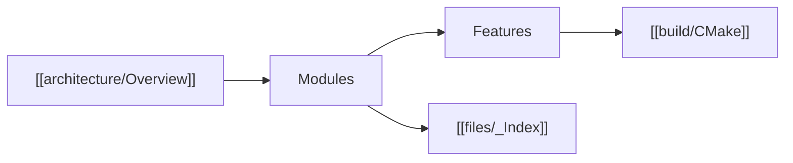

# Home

Technical documentation for **Vampire OS**. Sprint truth and parked work: [plan.md](../plan.md). How to build and run: [README.md](../../README.md).

This vault is the design of record for *what the tree does today* (closed at `vos-150`). Code wins if a note drifts; update the note with the code.

## Layers

1. **[[architecture/Overview|Architecture]]** — what exists, who owns it, how it connects.
2. **Modules** — what each area can do and how it is built:
   - [[modules/Boot]]
   - [[modules/Memory]]
   - [[modules/Tasks]]
   - [[modules/FS]]
   - [[modules/Block]]
   - [[modules/Console]]
   - [[modules/Net]]
   - [[modules/Userland]]
3. **Features** — implementation walkthroughs:
   - [[features/Syscalls]]
   - [[features/FAT12]]
   - [[features/ELF and COW]]
   - [[features/Shell]]
   - [[features/Framebuffer]]
   - [[features/Block backends]]
4. **[[build/CMake|Build]]** — NASM + clang + lld → `vampire.img`.
5. **[[files/_Index|File index]]** — boot, kernel, and first-party userland.

## Architecture shortcuts

- [[architecture/Boot Path]]
- [[architecture/Module Map]]
- [[architecture/Boundaries]]

## Build shortcuts

- [[build/CMake]]
- [[build/Disk Image]]

## Mental model

BIOS MBR loads stage 2. Stage 2 prints `boot` on COM1, loads the kernel, takes E820 + VBE, and jumps to `kmain` in the higher half. `kmain` builds PMM/VMM, probes VirtIO / AHCI / ATA / virtio-net, mounts FAT12 from MBR partition LBA **273**, then `run`s `init` which `fork`/`exec`s `sh`. Ring-3 ELFs live at `0x400000` on a private CR3. Syscalls are `int 0x30`. Proof of a slice is a QEMU boot that prints a line or runs a command that was impossible the day before.
