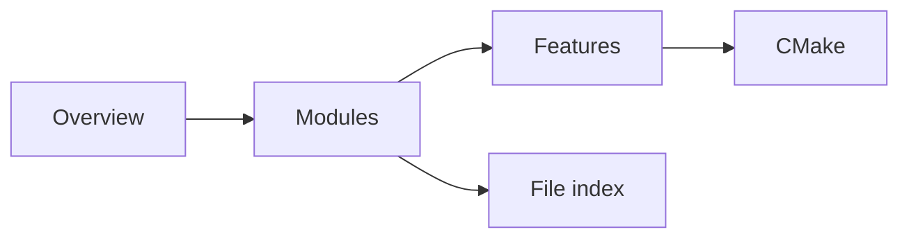

# Technical docs

Technical documentation for **Vampire OS**. How to build and run: [README.md](../../README.md).

Browse this folder on GitHub: each subdirectory has its own README.

- [Architecture](architecture/README.md)
- [Modules](modules/README.md)
- [Features](features/README.md)
- [Build](build/README.md)
- [File index](files/README.md)

These notes describe *what the tree does today* (after `vos-150`). If a page drifts from the code, the code wins — update the page.

## Layers

1. **[Architecture](architecture/overview.md)** — what exists, who owns it, how it connects.
2. **Modules** — what each area can do and how it is built:
   - [Boot](modules/boot.md)
   - [Memory](modules/memory.md)
   - [Tasks](modules/tasks.md)
   - [FS](modules/fs.md)
   - [Block](modules/block.md)
   - [Console](modules/console.md)
   - [Net](modules/net.md)
   - [Userland](modules/userland.md)
3. **Features** — implementation walkthroughs:
   - [Syscalls](features/syscalls.md)
   - [FAT12](features/fat12.md)
   - [ELF and COW](features/elf-and-cow.md)
   - [Shell](features/shell.md)
   - [Framebuffer](features/framebuffer.md)
   - [Block backends](features/block-backends.md)
4. **[Build](build/cmake.md)** — NASM + clang + lld → `vampire.img`.
5. **[File index](files/README.md)** — boot, kernel, and first-party userland.

## Architecture shortcuts

- [Boot path](architecture/boot-path.md)
- [Module map](architecture/module-map.md)
- [Boundaries](architecture/boundaries.md)

## Build shortcuts

- [CMake](build/cmake.md)
- [Disk image](build/disk-image.md)

## Mental model

BIOS MBR loads stage 2. Stage 2 prints `boot` on COM1, loads the kernel, takes E820 + VBE, and jumps to `kmain` in the higher half. `kmain` builds PMM/VMM, probes VirtIO / AHCI / ATA / virtio-net, mounts FAT12 from MBR partition LBA **273**, then `run`s `init` which `fork`/`exec`s `sh`. Ring-3 ELFs live at `0x400000` on a private CR3. Syscalls are `int 0x30`. Proof of a slice is a QEMU boot that prints a line or runs a command that was impossible the day before.
