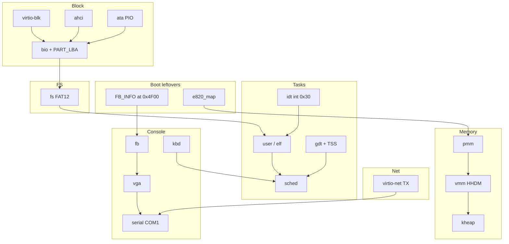

# Module map

Who talks to whom after `kmain` has switched to the HHDM stack.

- FAT never talks PCI. It calls `bread` / `bwrite` / `bflush` ([[kernel.bio.h]]).
- `user_on_syscall` is the only ring-3 entry besides exceptions ([[kernel.user.c]]).
- Console `write` on fd 1/2 hits VGA and COM1; the LFB overlay is a second view of the same line buffer ([[features/Framebuffer]]).
- VirtIO-net does not go through `bio`. One datagram at boot, then idle ([[modules/Net]]).

See [[architecture/Boundaries]] for what each side must not include.
