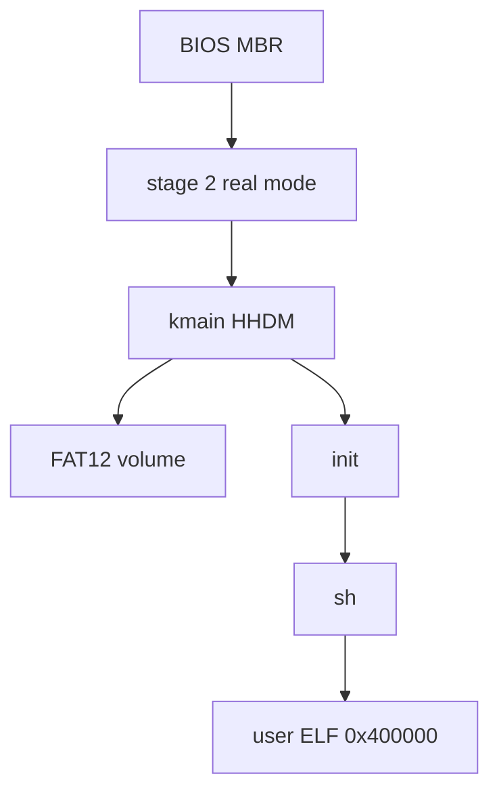

# Architecture overview

Vampire OS is a **freestanding x86_64 hobby kernel** with a BIOS MBR bootloader. The product boots in QEMU as `build/vampire.img`. There is no UEFI path, no second language, and no hosted libc — stay on the clang/nasm/lld flags in `CMakeLists.txt`.

## Layers of this vault

| Slice | Question | Start here |
| --- | --- | --- |
| Architectural | What are the modules and how do they meet? | this note, [[architecture/Module Map]], [[architecture/Boot Path]] |
| Modular | What can a module do, and how is it coded? | [[modules/Boot]] … [[modules/Userland]] |
| Detailed | How is a feature implemented? | [[features/Syscalls]] |
| Build | How does a disk image appear on disk? | [[build/CMake]], [[build/Disk Image]] |

## What boots

- Boot: [[modules/Boot]], [[architecture/Boot Path]].
- RAM: PMM bitmap + 2 MiB/4 KiB HHDM ([[modules/Memory]]).
- Tasks: 16 slots, private CR3, COW fork ([[modules/Tasks]], [[features/ELF and COW]]).
- Volume: FAT12 behind a block table ([[modules/FS]], [[modules/Block]]).
- Console: VGA 80×25, optional VBE LFB, COM1 mirror ([[modules/Console]], [[features/Framebuffer]]).
- Net: one virtio-net UDP datagram at boot ([[modules/Net]]).

## Module responsibilities

| Module | Owns | Does not own |
| --- | --- | --- |
| [[modules/Boot]] | MBR, stage 2, E820, VBE mode set, long mode, early `boot` on COM1 | FAT, tasks |
| [[modules/Memory]] | PMM, VMM, HHDM, kernel heap, ELF load into user pages | Block I/O |
| [[modules/Tasks]] | GDT/TSS, IDT/`int 0x30`, scheduler, fds, signals, pipes | BPB layout |
| [[modules/FS]] | FAT12, LFN, dirents, cwd, `sync` metadata | PCI / virtqueues |
| [[modules/Block]] | `bread`/`bwrite`/`bflush`, MBR `PART_LBA`, VirtIO-blk / AHCI / ATA | Shell syntax |
| [[modules/Console]] | VGA, serial, PS/2 kbd/mouse, LFB overlay | UDP |
| [[modules/Net]] | virtio-net probe + one TX UDP | Sockets, RX, DHCP |
| [[modules/Userland]] | CRT, `sh` / `init`, tests, freestanding `printf`/`malloc` | Kernel page tables |

How they connect: [[architecture/Module Map]]. What stays out of each layer: [[architecture/Boundaries]].

## Constants that must stay in lockstep

- On-disk kernel pad: `KERNEL_SECTORS` **256**, `PART_LBA` **273**, image **1307** sectors (`boot/const.inc`).
- PMM `KERNEL_SIZE` **304** sectors so `.bss` does not land on the bitmap (`kernel/pmm.c`). Bump pad and `KERNEL_SIZE` together when `kernel.raw.bin` no longer fits 256 sectors.

Code wins over this vault if they drift.
