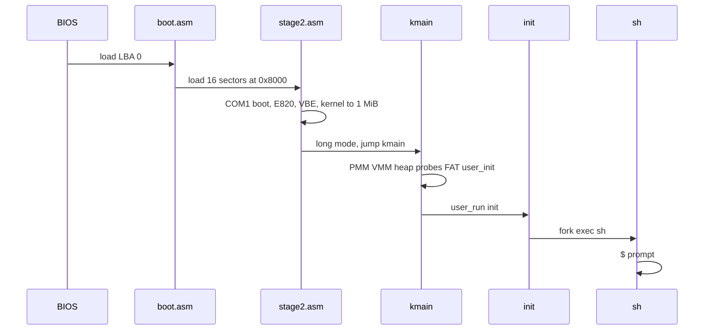

# Boot path

From reset to the first `$`.

1. **MBR** (`boot/boot.asm`) — 512 bytes, loads stage 2 (`STAGE2_LBA` 1, `STAGE2_SECTORS` 16).
2. **Stage 2** (`boot/stage2.asm`) — programs 16550 at `0x3F8` and prints `boot`; BIOS E820 into `0x4000`; VBE linear 640×480×32 when offered (else 800×600×32 or 24 bpp) and writes `FB_INFO` at `0x4F00`; reads the kernel in two DAP windows (128 + 128 sectors) to `KERNEL_PHYS` `0x100000`; builds PML4/PDPT/PD including `KERNEL_VMA`; `jmp` to `kmain`.
3. **kmain** (`kernel/kmain.c`) — VGA banner, PMM from E820, map usable RAM, HHDM, `fb_init`, switch stack, IDT, RTC snapshot, drop identity, heap, virtio-blk, virtio-net (MAC + one UDP), AHCI, ATA, `bio_init` (`part 273`), `fs_init`, `user_init`, `user_run("init")`, `user_enter`.
4. **init** (`user/init.c`) — `fork`/`exec` `sh`; if that shell dies, start another. Kernel `kbd>` is fallback if `init` cannot load.

Serial log on QEMU `-serial stdio`: `boot`, then `net 52:54:00:12:34:56`, then `udp sent`, then `$`.

Image layout: [Disk image](../build/disk-image.md). Constants: `boot/const.inc`.
