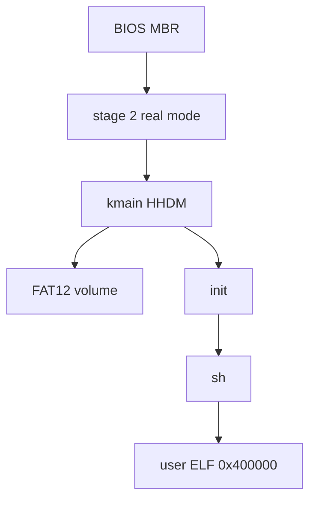

# Architecture overview

Vampire OS is a **freestanding x86_64 hobby kernel** with a BIOS MBR bootloader. The product boots in QEMU as `build/vampire.img`. There is no UEFI path, no second language, and no hosted libc — stay on the clang/nasm/lld flags in `CMakeLists.txt`.

## Layers of this vault

| Slice | Question | Start here |
| --- | --- | --- |
| Architectural | What are the modules and how do they meet? | this note, [Module map](module-map.md), [Boot path](boot-path.md) |
| Modular | What can a module do, and how is it coded? | [Boot](../modules/boot.md) … [Userland](../modules/userland.md) |
| Detailed | How is a feature implemented? | [Syscalls](../features/syscalls.md) |
| Build | How does a disk image appear on disk? | [CMake](../build/cmake.md), [Disk image](../build/disk-image.md) |

## What boots

- Boot: [Boot](../modules/boot.md), [Boot path](boot-path.md).
- RAM: PMM bitmap + 2 MiB/4 KiB HHDM ([Memory](../modules/memory.md)).
- Tasks: 16 slots, private CR3, COW fork ([Tasks](../modules/tasks.md), [ELF and COW](../features/elf-and-cow.md)).
- Volume: FAT12 behind a block table ([FS](../modules/fs.md), [Block](../modules/block.md)).
- Console: VGA 80×25, optional VBE LFB, COM1 mirror ([Console](../modules/console.md), [Framebuffer](../features/framebuffer.md)).
- Net: one virtio-net UDP datagram at boot ([Net](../modules/net.md)).

## Module responsibilities

| Module | Owns | Does not own |
| --- | --- | --- |
| [Boot](../modules/boot.md) | MBR, stage 2, E820, VBE mode set, long mode, early `boot` on COM1 | FAT, tasks |
| [Memory](../modules/memory.md) | PMM, VMM, HHDM, kernel heap, ELF load into user pages | Block I/O |
| [Tasks](../modules/tasks.md) | GDT/TSS, IDT/`int 0x30`, scheduler, fds, signals, pipes | BPB layout |
| [FS](../modules/fs.md) | FAT12, LFN, dirents, cwd, `sync` metadata | PCI / virtqueues |
| [Block](../modules/block.md) | `bread`/`bwrite`/`bflush`, MBR `PART_LBA`, VirtIO-blk / AHCI / ATA | Shell syntax |
| [Console](../modules/console.md) | VGA, serial, PS/2 kbd/mouse, LFB overlay | UDP |
| [Net](../modules/net.md) | virtio-net probe + one TX UDP | Sockets, RX, DHCP |
| [Userland](../modules/userland.md) | CRT, `sh` / `init`, tests, freestanding `printf`/`malloc` | Kernel page tables |

How they connect: [Module map](module-map.md). What stays out of each layer: [Boundaries](boundaries.md).

## Constants that must stay in lockstep

- On-disk kernel pad: `KERNEL_SECTORS` **256**, `PART_LBA` **273**, image **1307** sectors (`boot/const.inc`).
- PMM `KERNEL_SIZE` **304** sectors so `.bss` does not land on the bitmap (`kernel/pmm.c`). Bump pad and `KERNEL_SIZE` together when `kernel.raw.bin` no longer fits 256 sectors.

Code wins over this vault if they drift.
