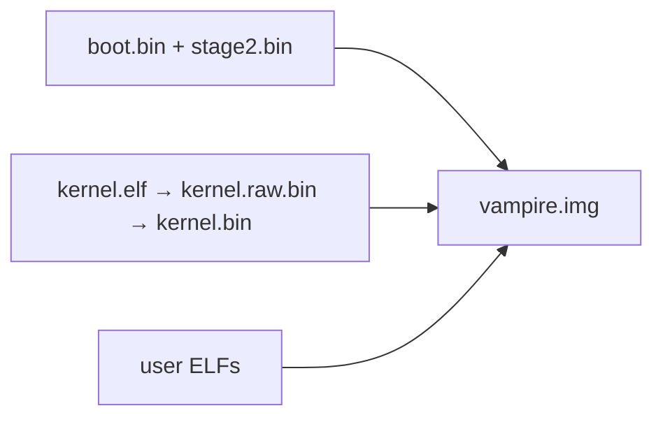

# CMake

Host tools, not a compiler ID for the kernel: `project(vampire-os LANGUAGES NONE)`.

## Tools

`nasm`, `clang`, `ld.lld`, `llvm-objcopy`, `qemu-system-x86_64`. Optional `.tools/` hints. Flags stay in `CMakeLists.txt` (freestanding, no hosted libc).

## Graph

- `cmake -B build && cmake --build build` → `build/vampire.img`.
- `cmake --build build --target run` — QEMU `-vga std -serial stdio`, IDE + AHCI + virtio-blk + virtio-net, `-rtc base=2027-01-15T17:15:00`.

User C programs: clang → ELF at `0x400000` with [user/user.ld](../files/user.user.ld.md). NASM tests: `user/*.asm` packed the same way.

See [Disk image](disk-image.md), [Boundaries](../architecture/boundaries.md).
